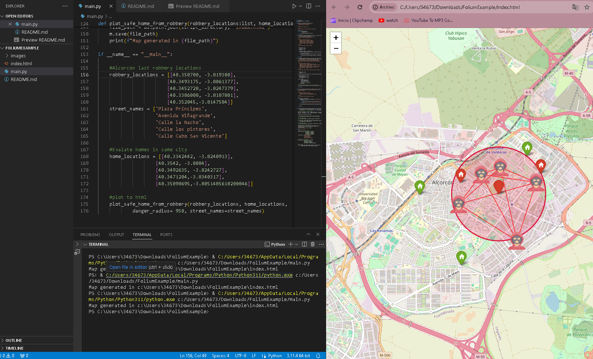

# Detection of safe areas with folium
This project focuses on utilizing Folium, a Python library for visualizing geospatial data, to detect and mark safe zones on a map. The concept of safe zones can vary depending on the context, but in this project, it refers to areas where a robbery has recently occurred.

For further details see the folium docs https://github.com/python-visualization/folium/blob/master/README.rst

##Example usage

